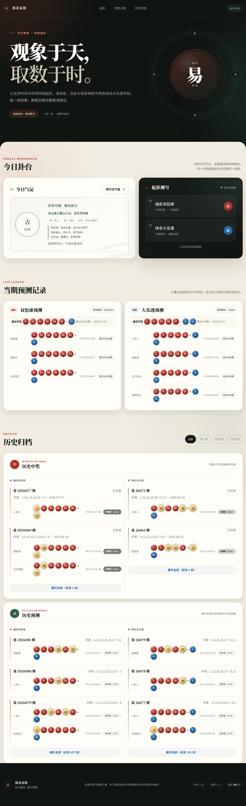

# 梅花易数 · 时辰起卦

> 观象于天，取数于时

基于梅花易数时间起卦的彩票号码娱乐工具。v3.0 采用现代东方工作台界面，以「今日卦台 → 本时辰推演 → 当期记录 → 历史归档」组织完整体验；起卦、变卦、互卦和体用关系尽量按传统规则保持自洽，福彩双色球和体彩大乐透分别生成可解释、可复现的号码。

## 🚀 在线演示

访问：[https://peiorange888.github.io/meihua-lottery/](https://peiorange888.github.io/meihua-lottery/)

## 📸 效果展示

| 现代东方桌面首页 | 今日气运 | 福彩起卦 | 体彩起卦 |
|---------|---------|---------|---------|
|  |  |  |  |

| 移动端 | 福彩详细推导 | 体彩详细推导 | 历史预测展开 |
|--------|-------------|-------------|---------------|
|  |  |  |  |

## 功能特点

- 🔮 **时间起卦**：使用北京时间、农历年月日和时辰数生成本卦、变卦、互卦
- 🎲 **分彩种生成**：福彩双色球和体彩大乐透按各自号码范围独立映射
- 📖 **可解释推导**：逐项展示本卦序、变卦序、互卦序、体用关系和归藏结果
- 🔁 **可复现结果**：去重调整不使用随机数，同一卦象可稳定复现
- 🕰️ **一时一卦**：同一彩种在同一时辰内重复点击会复用缓存结果，不重复新增预测
- 🌟 **气运断势**：基于体用、时令和动爻给出卦势解读，不参与号码生成
- 🎨 **现代东方工作台**：以玄墨、朱砂和青玉构建设计系统，结合环形易印、纸面卡片与彩票色彩语义
- 🧾 **清晰信息架构**：今日卦台、本时辰推演、当期预测记录和历史归档逐级展示
- 📱 **响应式设计**：桌面双栏、平板自适应、移动端单列，并针对开奖记录优化触控尺寸和信息密度
- ♿ **可访问交互**：支持键盘焦点、跳转主要内容、动态状态播报、按钮忙碌状态和减少动画偏好
- 🧭 **结果自动定位**：起卦完成后自动平滑定位到推演结果，减少移动端查找成本
- 📋 **预测记录**：实时记录并展示所有访问者的当期预测记录
- 🏮 **玄学昵称**：每位访问者随机分配道家风格昵称（如"天机老人"、"太极真人"），自己的记录朱砂色高亮
- 🎯 **中奖匹配**：自动获取开奖结果，匹配并高亮中奖号码
- 🏆 **历史中奖**：按时间范围筛选，只聚合展示已中奖记录，默认紧凑展示，可展开全部
- 📊 **历史预测**：追踪所有已结算预测，未中奖也保留命中数量，替代旧版“结算明细”叫法
- 🔄 **后台结算**：GitHub Actions 每 30 分钟结算待开奖记录

## 算法说明

### 核心原理

本工具以《梅花易数》"时间起卦法"为基础。起卦、变卦、互卦、体用和五行生克尽量按传统规则保持自洽；彩票号码部分属于娱乐映射，不代表任何真实概率优势。

### 起卦流程

```
北京时间当前时刻
       │
       ▼
  农历年支数、农历月、农历日、时辰数
       │
       ▼
  上卦 = (年支数+农历月+农历日) 归藏到 8
  下卦 = (年支数+农历月+农历日+时辰数) 归藏到 8
  动爻 = (年支数+农历月+农历日+时辰数) 归藏到 6
       │
       ▼
  本卦 = 上卦 + 下卦 → 文王64卦之一
       │
       ▼
  六爻自下而上排列，动爻阴阳互变为变卦
  二三四爻为互卦下卦，三四五爻为互卦上卦
       │
       ▼
  体卦 / 用卦（动爻所在卦为用，另一卦为体）
  体用关系 → 五行生克判定
```

### 关键概念

| 概念 | 含义 | 示例 |
|------|------|------|
| **先天八卦数** | 八卦对应数字 | 乾1 兑2 离3 震4 巽5 坎6 艮7 坤8 |
| **文王64卦序** | 本卦、变卦、互卦使用的卦序 | 乾为天1、坤为地2、火水未济64 |
| **体用关系** | 体为主，用为客 | 体卦代表"我"，用卦代表"事" |
| **归藏** | 数有尽时循环往复 | 35 % 8 = 3 → 离卦 |
| **五行生克** | 木火土金水相生相克 | 木生火、火生土、木克土 |

### 体用生克与卦势

体用关系用于判断事情趋势，不再反向影响号码映射：

| 关系 | 含义 | 卦势判断 |
|------|------|----------|
| 用生体 | 他生我，外事助我 | 吉，得助力 |
| 比和 | 五行相同，同气相应 | 平顺，中和 |
| 体克用 | 我克他，体能制事 | 可为，但需用力 |
| 体生用 | 我生他，体气外泄 | 有付出，宜谨慎 |
| 用克体 | 他克我，体受制约 | 阻力重，宜观望 |

### 号码生成步骤

#### 双色球（6红 + 1蓝）

1. **红球 6 个来源**：
   - 本卦文王序归藏（33以内）
   - 变卦文王序归藏（33以内）
   - 互卦文王序归藏（33以内）
   - 体卦、用卦、动爻、时辰和互卦综合归藏（33以内）
   - 上下卦组合数 + 农历日归藏（33以内）
   - 变卦、互卦、体用乘数、动爻和年支综合归藏（33以内）

2. **确定性去重**：若候选数重复，用本卦、变卦、互卦、动爻和序号计算固定步长，循环偏移直至唯一。

3. **蓝球**：动爻、时辰、体卦、用卦和农历月归藏（16以内）。

#### 大乐透（5前 + 2后）

1. **前区 5 个来源**：
   - 本卦文王序归藏（35以内）
   - 变卦文王序归藏（35以内）
   - 互卦文王序归藏（35以内）
   - 体用综合数 + 农历月归藏（35以内）
   - 动爻、时辰、互卦上下卦和年支综合归藏（35以内）

2. **后区 2 个**：
   - 互卦上卦 + 动爻 + 农历月 → 归藏（12以内）
   - 互卦下卦 + 时辰 + 体卦 + 年支 → 归藏（12以内）

3. **确定性去重**：后区重复时同样使用固定步长调整，保证同一卦象结果可复现。

### 气运系统

气运是独立的卦象断势，只用于解释趋势，不参与双色球或大乐透号码生成：

| 断势项 | 判断方式 |
|--------|----------|
| 体用 | 用生体、比和、体克用为偏吉；体生用、用克体为偏谨慎 |
| 时令 | 农历月定五行，判断体卦是否得令、受生、受克或泄气 |
| 动爻 | 初爻主初起，二五较稳，三上多变，四爻近外应 |
| 展示 | 输出卦势等级、分数、依据和娱乐性建议 |

### 归藏公式

```
归藏(n, max) = n % max === 0 ? max : n % max
```

即：取余数，若余数为0则取最大值。保证结果始终在 [1, max] 范围内。

## 数据存储

使用 **Firebase Realtime Database** 存储，所有访问者共享预测数据。

**存储地址**：`https://meihua-abb40-default-rtdb.firebaseio.com/lottery.json`

当前数据结构按彩种分支保存：

- `qigua_count`：累计起卦次数，浏览器使用 Firebase server-side increment 单次递增
- `ssq`：双色球预测、开奖和历史中奖记录
- `dlt`：大乐透预测、开奖和历史中奖记录

浏览器端只新增 `ssq/records/{id}` 或 `dlt/records/{id}` 预测记录，不覆盖整棵彩种分支；后台结算任务再按记录 key 移入历史中奖/结算分组。预测记录和历史记录写入时会转换为稳定 key 的对象格式，读取时兼容旧的数组格式。

Firebase Realtime Database Rules 参考 `firebase-database.rules.json`。静态网页无法完全隐藏写权限，安全边界和发布步骤见 `SECURITY.md`。

开奖结算由后台任务处理：

- GitHub Actions 每 30 分钟运行 `scripts/settle-lottery-admin.mjs` 结算待开奖记录
- 浏览器端负责生成预测、读取数据和展示最新开奖，不再主动结算历史记录

## 更新日志

### v3.0.0 (2026-07-18)
- 🎨 **前端整体重设计**：升级为现代东方视觉，建立玄墨、朱砂、青玉三层设计令牌体系
- 🧭 **信息架构重构**：重做品牌首屏、今日卦台、推演结果、当期记录和历史归档
- 📱 **响应式体验优化**：改善 390px 移动端排版、开奖记录扫描效率与触控尺寸
- ♿ **无障碍增强**：补充语义化结构、ARIA 状态、键盘焦点、动态播报与减少动画支持
- ✨ **交互体验优化**：起卦后自动定位结果，详细推导和历史展开同步可访问状态
- 🧪 **完整视觉回归**：覆盖桌面、移动端、气运、双彩种起卦、详细推导和历史展开截图
- ⚙️ **缓存刷新**：静态资源版本号更新到 `3.0.0`

### 时辰缓存回归测试 (2026-07-06)
- ✅ **同一时辰缓存测试**：覆盖重复起卦不新增记录、不递增起卦次数并显示提示
- 📝 **文档补充**：功能说明补充“一时一卦”缓存行为

### UI 文档同步 (2026-07-04)
- 📝 **README 同步新版 UI**：更新工作台、历史中奖、历史预测和截图说明
- 📝 **术语统一**：将旧版“结算明细”统一为当前页面的“历史预测”

### v2.3.0 (2026-06-11)
- ♻️ **气运断势重构**：气运改为独立卦象解读，展示体用、时令和动爻依据
- ♻️ **号码算法解耦**：双色球和大乐透号码不再使用体用吉凶系数或生克偏移
- 🎨 **气运展示优化**：从单一分数改为卦势等级、分数、依据和建议
- ⚙️ **缓存刷新**：静态资源版本号更新到 `2.3.0`

### v2.2.2 (2026-06-11)
- 🎨 **历史区域优化**：历史中奖和结算明细默认紧凑展示，支持展开全部
- 📱 **移动端减负**：减少历史数据对移动端页面长度的影响
- ⚙️ **缓存刷新**：静态资源版本号更新到 `2.2.2`

### v2.2.1 (2026-06-11)
- 🎨 **UI/UX 调整**：重做纸墨面板、按钮、记录列表、筛选标签和移动端密度
- 🎨 **号码色彩修正**：蓝球/后区改为明确蓝色，命中奖号保留金色高亮
- ⚙️ **缓存刷新**：静态资源版本号更新到 `2.2.1`

### v2.2.0 (2026-06-11)
- ♻️ **梅花易数算法重构**：改为北京时间农历年月日时起卦，统一六爻自下而上
- ♻️ **卦象数据重建**：使用先天八卦数和文王64卦序，修复旧卦表重复和爻序错配
- ♻️ **可复现号码映射**：去除随机去重，改用卦象数据计算确定性偏移
- ✨ **完整推导展示**：每个号码展示对应来源、归藏结果和去重调整
- ✅ **算法测试**：新增核心测试覆盖卦表完整性、号码范围、去重和确定性

### v2.1.2 (2026-06-11)
- 🔧 **大乐透奖级修正**：按体彩规则修正六等奖至九等奖匹配
- ♻️ **历史结算校正**：前端展示即时重算历史匹配，定时结算脚本回写旧记录
- ⚙️ **缓存刷新**：静态资源版本号更新到 `2.1.2`

### v2.1.0 (2026-06-10)
- ✨ **开奖结算**：预测记录绑定期号，开奖后自动结算并归档中奖记录
- ✨ **时间筛选**：历史中奖支持全部、近7天、近30天、近90天筛选
- ✨ **结算明细**：展示所有已结算预测的命中球数
- 🎨 **中奖高亮**：命中球改为金色印章效果，减少强脉冲干扰
- ♻️ **数据层重构**：分支保存、稳定 key、数据版本号、减少重复写入
- ♻️ **代码结构**：拆分 HTML、CSS、JS，保留 GitHub Pages 静态部署
- ⚙️ **后台结算**：新增 GitHub Actions 定时结算脚本
- ♻️ **前端降级**：浏览器只负责预测和展示，后台负责开奖结算

### v2.0.0 (2026-05-28)
- 🎨 **全面重构**：中国水墨玄学风格 UI 设计
- ✨ **独立起卦**：福彩和体彩分开起卦
- ✨ **玄学昵称**：5625种道家风格昵称随机分配
- ✨ **自动更新**：每 30 分钟自动获取开奖数据
-  **中奖高亮**：命中球数标注、金色脉冲动画
-  **中奖记录**：仅展示已中奖的历史记录
-  **性能优化**：模块化代码结构，防抖保存
- 🔧 **修复**：不蒜子统计 ID 格式、详细推导渲染

### v1.3.0 (2026-05-28)
- ✨ **功能优化**：福彩双色球和体彩大乐透分开起卦

### v1.2.0 (2026-05-27)
- ✨ 预测时间显示、历史中奖记录、金色脉冲动画
- 🚀 数据存储迁移到 Firebase

### v1.1.0 (2026-05-20)
- ✨ 气运测试系统、预测记录、开奖匹配

### v1.0.0 (2026-05-15)
- ✨ 初始版本发布

## 技术栈

- HTML5 + CSS3 + JavaScript（原生）
- Google Fonts（Noto Serif SC + Noto Sans SC）
- Firebase Realtime Database
- 纯前端实现，无需后端

## 使用方法

### 本地运行

双击 `index.html` 文件在浏览器中打开，或使用本机 Chrome 做截图检查。

### 数据备份

导出 Firebase 当前数据到本地 `backups/` 目录：

```bash
node scripts/export-data.mjs
```

备份文件不会提交到 GitHub，`.gitignore` 已排除 `backups/*.json`。

### 算法测试

验证卦表完整性、起卦确定性、号码范围和去重：

```bash
node scripts/test-core.mjs
```

### 视觉检查

生成桌面首页、气运断势、起卦后页面、详细推导、移动端和历史预测展开截图：

```bash
node scripts/visual-check.mjs
```

截图输出到 `tmp/visual-check/`，该目录不会提交到 GitHub。脚本依赖全局 `codex-browser` 命令和本机 Chrome，其中详细推导与历史预测展开截图需要 `codex-browser scriptshot` 支持。

### 在线访问

[GitHub Pages 在线演示](https://peiorange888.github.io/meihua-lottery/)

## 部署

1. 推送到 GitHub 仓库
2. Settings → Pages → Deploy from branch → main
3. 等待 1-2 分钟即可访问

## 文件结构

```
meihua-lottery/
├── index.html          # 页面结构
├── assets/
│   ├── css/
│   │   └── styles.css  # 页面样式
│   └── js/
│       ├── config.js   # 配置、常量、卦象数据
│       ├── data.js     # 用户身份和 Firebase 存储
│       ├── logic.js    # 开奖 API、起卦、号码生成、中奖匹配
│       ├── ui.js       # 页面渲染和筛选
│       └── app.js      # 应用启动和事件绑定
├── scripts/
│   ├── settle-lottery-admin.mjs # GitHub Actions Admin SDK 定时结算脚本
│   ├── export-data.mjs    # 导出 Firebase 数据到本地
│   ├── test-core.mjs      # 核心算法测试
│   └── visual-check.mjs   # 本地 UI 截图检查
├── .github/
│   └── workflows/
│       └── settle-lottery-admin.yml # 每 30 分钟结算待开奖记录
├── README.md           # 项目文档
├── DEPLOY.md           # 部署指南
├── SECURITY.md         # Firebase 安全说明
├── firebase-database.rules.json # Realtime Database 规则参考
└── screenshots/        # 效果图
    └── 1-8.png         # 首页、气运、起卦、推导、移动端和历史预测截图
```

## 注意事项

⚠️ 彩票开奖为独立随机事件，本工具仅供娱乐，不构成投注建议。请理性购彩。

## 许可

MIT License

## 致谢

- 梅花易数起卦流程参考传统易学理论
- 页面视觉采用现代东方设计语言，以玄墨、朱砂、青玉和彩票红蓝球建立一致的视觉语义
