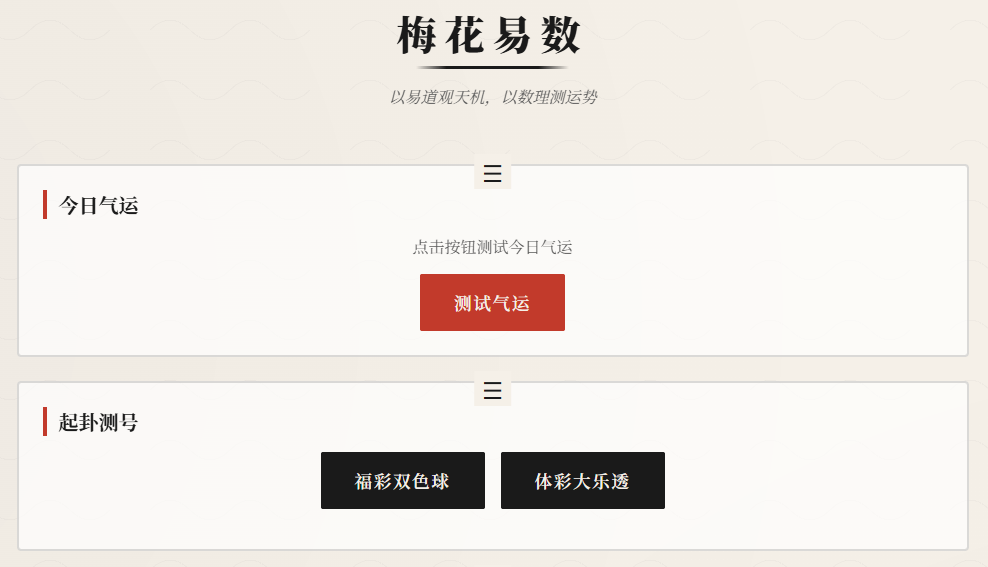
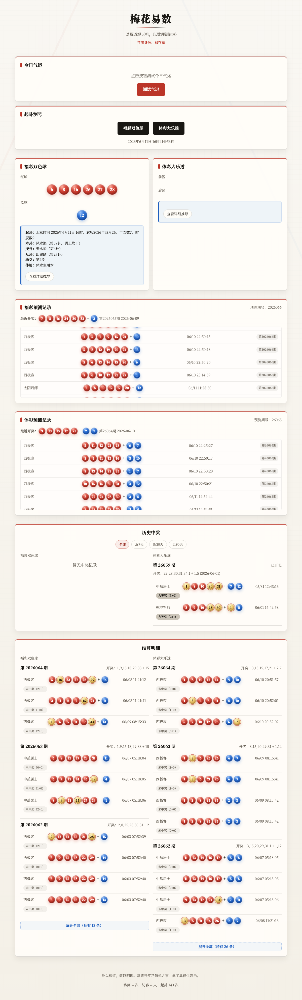
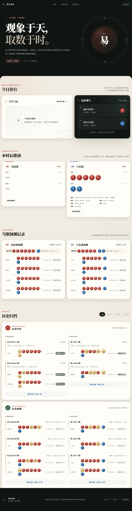
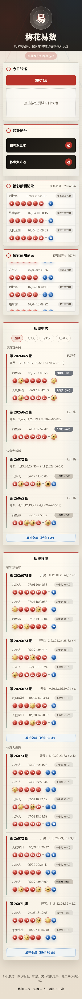
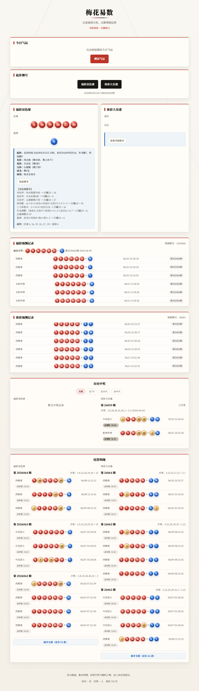
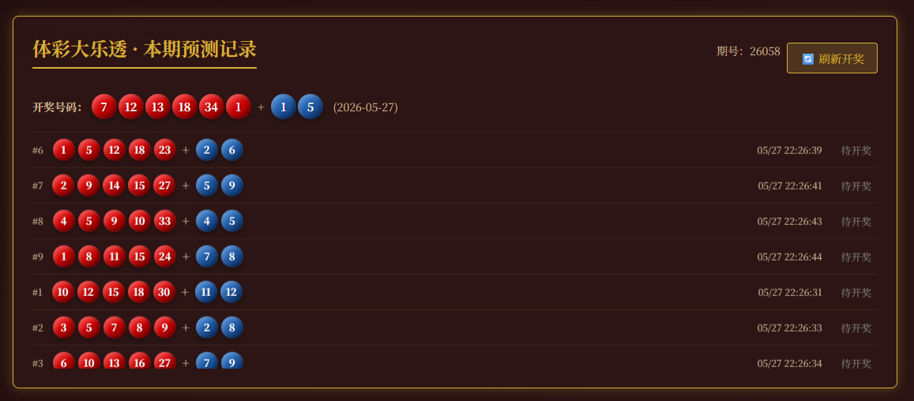

# 梅花易数 · 彩票预测

> 以易道观天机，以数理测运势

基于梅花易数算法的彩票号码预测网页应用，中国水墨玄学风格界面，独立起卦生成福彩双色球和体彩大乐透号码。

## 🚀 在线演示

访问：[https://peiorange888.github.io/meihua-lottery/](https://peiorange888.github.io/meihua-lottery/)

## 📸 效果展示

| 主界面 | 气运测试 | 号码生成 | 详细推导 |
|--------|---------|---------|---------|
|  |  |  |  |

| 福彩预测记录 | 体彩预测记录 | 历史中奖记录 |
|-------------|-------------|-------------|
|  |  |  |

## 功能特点

- 🔮 **独立起卦**：福彩双色球和体彩大乐透各算一卦，互不干扰
- 🎨 **水墨玄学**：宣纸底色、墨色文字、朱砂点缀，阴阳八卦装饰
- 📱 **响应式设计**：适配手机和电脑端
- 📖 **卦象解读**：显示本卦、变卦、互卦及体用关系
- 🔍 **详细推导**：点击可查看号码生成的具体计算过程
- 🌟 **气运测试**：测试今日气运，给出购彩建议
- 📋 **预测记录**：实时记录并展示所有访问者的预测记录
- 🏮 **玄学昵称**：每位访问者随机分配道家风格昵称（如"天机老人"、"太极真人"），自己的记录朱砂色高亮
- 🎯 **中奖匹配**：自动获取开奖结果，匹配并高亮中奖号码
- 🏆 **中奖记录**：仅展示已中奖的历史记录，标注奖项等级和命中球数
- 🔄 **自动更新**：每 30 分钟自动获取最新开奖数据，无需手动刷新
- 🎭 **滚动展示**：预测记录自动滚动，鼠标悬停暂停
- 🎨 **命中高亮**：中奖号码球金色脉冲动画，一目了然

## 算法说明

### 核心原理

本工具以《梅花易数》"时间起卦法"为基础，将传统易学中的**卦象推演**与**五行生克**映射为彩票号码生成过程。

### 起卦流程

```
当前时间（年月日时分秒）
       │
       ▼
  上卦 = (年+月+日) % 8    →  八卦之一（乾~坤）
  下卦 = (年+月+日+时+分+秒) % 8
       │
       ▼
  本卦 = 上卦 + 下卦 → 64卦之一
  动爻 = (上卦+下卦之和) % 6
       │
       ▼
  变卦 = 本卦动爻阴阳互变
  互卦 = 本卦中间四爻重组成卦
       │
       ▼
  体卦 / 用卦（动爻所在卦为用，另一卦为体）
  体用关系 → 五行生克判定
```

### 关键概念

| 概念 | 含义 | 示例 |
|------|------|------|
| **先天八卦数** | 八卦对应数字 | 乾1 兑2 离3 震4 巽5 坎6 艮7 坤8 |
| **体用关系** | 体为主，用为客 | 体卦代表"我"，用卦代表"事" |
| **归藏** | 数有尽时循环往复 | 35 % 8 = 3 → 离卦 |
| **五行生克** | 木火土金水相生相克 | 木生火、火生土、木克土 |

### 体用生克与运算系数

体用关系决定了数值运算的方向和幅度：

| 关系 | 系数 | 含义 | 运算倾向 |
|------|------|------|----------|
| 体生用 | 0.7 | 我生他，付出多 | 数值偏小 |
| 体克用 | 1.3 | 我克他，主控局面 | 数值偏大 |
| 用生体 | 1.1 | 他生我，得助力 | 数值偏大 |
| 用克体 | 0.9 | 他克我，受制约 | 数值偏小 |
| 比和 | 1.0 | 五行相同，中和 | 数值居中 |

### 号码生成步骤

#### 双色球（6红 + 1蓝）

1. **红球 6 个来源**：
   - 本卦卦序归藏（33以内）
   - 变卦卦序归藏（33以内）
   - 体用运算归藏（33以内）
   - 互卦上卦 × 下卦 归藏（33以内）
   - 上卦×10 + 下卦 归藏（33以内）
   - 变卦卦序 × 生克系数 归藏（33以内）

2. **去重调整**：若候选数重复，则按步长偏移直至唯一

3. **蓝球**：体用运算值 + 时辰地支 → 归藏（16以内）

#### 大乐透（5前 + 2后）

1. **前区 5 个来源**：
   - 本卦卦序归藏（35以内）
   - 变卦卦序归藏（35以内）
   - 体用运算归藏（35以内）
   - 互卦上×下 + 时辰 归藏（35以内）
   - 动爻 × 时辰 × 系数 归藏（35以内）

2. **后区 2 个**：
   - 互卦上卦 + 动爻 → 归藏（12以内）
   - 互卦下卦 + 时辰 → 归藏（12以内）

### 气运系统

基于体用关系和季节五行计算气运分数：

| 基础分 | 体用加分/减分 | 季节加分 | 总分 | 等级 |
|--------|-------------|---------|------|------|
| 50 | 用生体 +30 / 用克体 -30 | 体卦当令 +10 | 0~100 | 大吉/吉/平/小凶/大凶 |

### 归藏公式

```
归藏(n, max) = n % max === 0 ? max : n % max
```

即：取余数，若余数为0则取最大值。保证结果始终在 [1, max] 范围内。

## 数据存储

使用 **Firebase Realtime Database** 存储，所有访问者共享预测数据。

**存储地址**：`https://meihua-abb40-default-rtdb.firebaseio.com/lottery.json`

当前数据结构按彩种分支保存：

- `qigua_count`：累计起卦次数
- `ssq`：双色球预测、开奖和历史中奖记录
- `dlt`：大乐透预测、开奖和历史中奖记录

保存时只更新变化的分支，避免每次操作覆盖整个数据根节点。预测记录和历史记录写入时会转换为稳定 key 的对象格式，读取时兼容旧的数组格式。

Firebase Realtime Database Rules 参考 `firebase-database.rules.json`。静态网页无法完全隐藏写权限，安全边界和发布步骤见 `SECURITY.md`。

## 更新日志

### v2.1.0 (2026-06-10)
- ✨ **开奖结算**：预测记录绑定期号，开奖后自动结算并归档中奖记录
- ✨ **时间筛选**：历史中奖支持全部、近7天、近30天、近90天筛选
- 🎨 **中奖高亮**：命中球改为金色印章效果，减少强脉冲干扰
- ♻️ **数据层重构**：分支保存、稳定 key、数据版本号、减少重复写入
- ♻️ **代码结构**：拆分 HTML、CSS、JS，保留 GitHub Pages 静态部署

### v2.0.0 (2026-05-28)
- 🎨 **全面重构**：中国水墨玄学风格 UI 设计
- ✨ **独立起卦**：福彩和体彩分开起卦
- ✨ **玄学昵称**：5625种道家风格昵称随机分配
- ✨ **自动更新**：每 30 分钟自动获取开奖数据
-  **中奖高亮**：命中球数标注、金色脉冲动画
-  **中奖记录**：仅展示已中奖的历史记录
-  **性能优化**：模块化代码结构，防抖保存
- 🔧 **修复**：不蒜子统计 ID 格式、详细推导渲染

### v1.3.0 (2026-05-28)
- ✨ **功能优化**：福彩双色球和体彩大乐透分开起卦

### v1.2.0 (2026-05-27)
- ✨ 预测时间显示、历史中奖记录、金色脉冲动画
- 🚀 数据存储迁移到 Firebase

### v1.1.0 (2026-05-20)
- ✨ 气运测试系统、预测记录、开奖匹配

### v1.0.0 (2026-05-15)
- ✨ 初始版本发布

## 技术栈

- HTML5 + CSS3 + JavaScript（原生）
- Google Fonts（Noto Serif SC）
- Firebase Realtime Database
- 纯前端实现，无需后端

## 使用方法

### 本地运行

双击 `index.html` 文件在浏览器中打开。

### 在线访问

[GitHub Pages 在线演示](https://peiorange888.github.io/meihua-lottery/)

## 部署

1. 推送到 GitHub 仓库
2. Settings → Pages → Deploy from branch → main
3. 等待 1-2 分钟即可访问

## 文件结构

```
meihua-lottery/
├── index.html          # 页面结构
├── assets/
│   ├── css/
│   │   └── styles.css  # 页面样式
│   └── js/
│       ├── config.js   # 配置、常量、卦象数据
│       ├── data.js     # 用户身份和 Firebase 存储
│       ├── logic.js    # 开奖 API、起卦、号码生成、中奖匹配
│       ├── ui.js       # 页面渲染和筛选
│       └── app.js      # 应用启动和事件绑定
├── README.md           # 项目文档
├── DEPLOY.md           # 部署指南
├── SECURITY.md         # Firebase 安全说明
├── firebase-database.rules.json # Realtime Database 规则参考
└── screenshots/        # 效果图
    ├── 1-4.png         # 功能截图
    └── 5-7.png         # 预测记录截图
```

## 注意事项

⚠️ 彩票开奖为独立随机事件，本工具仅供娱乐，不构成投注建议。请理性购彩。

## 许可

MIT License

## 致谢

- 梅花易数算法参考传统易学理论
- 界面设计采用中国水墨玄学风格
